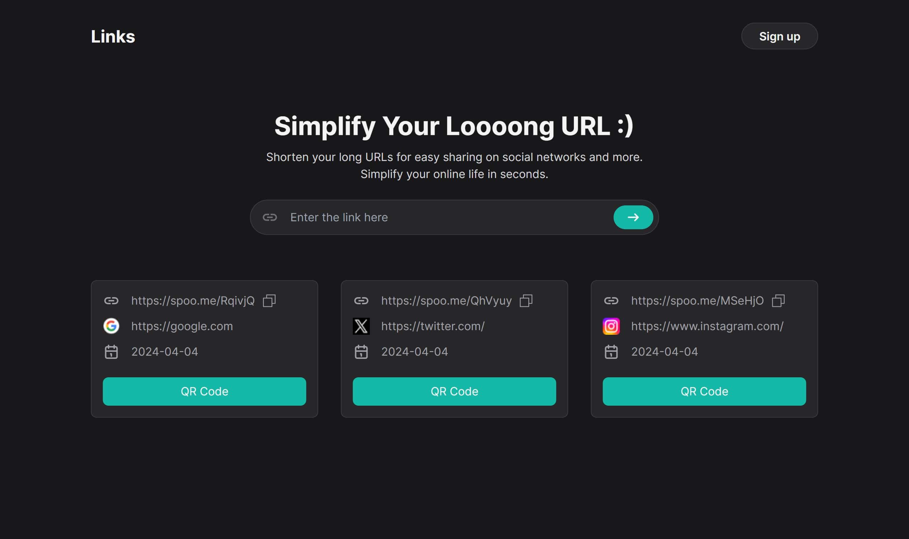

# Aplicación Web de Acortador de URLs

Esta aplicación web te permite acortar URLs de manera rápida y sencilla. Está construida utilizando Next.js para el desarrollo del frontend y Tailwind CSS para el estilo. La funcionalidad de acortamiento de URL está alimentada por la [API de Spoo.me](https://spoo.me/api), mientras que la generación de códigos QR utiliza la API [goQR.me](https://goqr.me/api/).

## Características

- **Acortamiento de URLs**: Acorta fácilmente URLs largas a versiones más manejables.
- **Generación de Códigos QR**: Genera códigos QR para las URLs acortadas para facilitar su compartición y escaneo.
- **Diseño Adaptable**: Asegura una experiencia sin problemas en diversos dispositivos.

## Uso

1. Ingresa la URL larga que deseas acortar en el campo de entrada proporcionado.
2. Haz clic en el botón "Acortar" para generar una URL acortada.
3. Opcionalmente, haz clic en el botón "Generar Código QR" para crear un código QR para la URL acortada.
